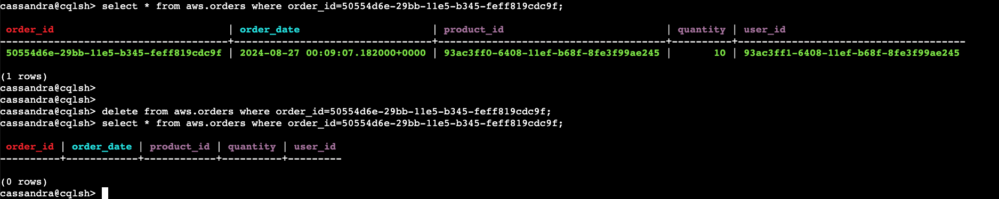

# Guidance for Near Real-Time Data Migration from Apache Cassandra to Amazon Keyspaces


## Table of Content

1. [Overview](#overview)
    - [Cost](#cost)
2. [Prerequisites](#prerequisites)
    - [Operating System](#operating-system)
    - [AWS account requirements](#AWS-account-requirements)
    - [Supported Regions](#Supported-Regions)
3. [Deployment Steps](#deployment-steps)
4. [Deployment Validation](#deployment-validation)
5. [Running the Guidance](#running-the-guidance)
6. [Next Steps](#next-steps)
7. [Cleanup](#cleanup)

***Optional***

8. [FAQ, known issues, additional considerations, and limitations](#faq-known-issues-additional-considerations-and-limitations-optional)
9. [Revisions](#revisions-optional)
10. [Notices](#notices-optional)
11. [Authors](#authors-optional)

## Overview

This Guidance demonstrates how to efficiently migrate data from self-managed Apache Cassandra clusters to Amazon Keyspaces using CQL Replicator in near real-time.CQLReplicator is an open source utility built by AWS Solutions Architects that helps customers migrate data from self-managed Apache Cassandra to Amazon Keyspaces in near real time.

The objective of this guidance is to support customers in seamlessly migrating data from self-managed Apache Cassandra clusters to Amazon Keyspaces using CQL replicator. CQLReplicator is an open source utility built by AWS Solutions Architects that helps customers migrate data from self-managed Apache Cassandra to Amazon Keyspaces in near real time.Included sample code features CloudFormation templates that significantly reduce the complexity of setting up key components such as VPC, Subnets, Security groups, IAM roles and Cassandra cluster, reducing manual configuration efforts. These templates, along with additional steps allows you to load data into Apache Cassandra cluster and migrate the data using CQLReplicator. 

Architecture diagram:


### Cost

You are responsible for the cost of the AWS services used while running this Guidance.

As of 09/11/2024, the cost for running this guidance with the default settings in the US East (N. Virginia) is approximately $434.57 per month for creating resources (Three node Cassandra Cluster, Cassandra client EC2 instance, Amazon Keyspaces and AWS Glue job) using guidance cloudformation templates and migrating 64K records in a Cassandra table to Amazon Keyspaces using AWS Glue.


The following table provides a sample cost breakdown for deploying this Guidance with the default parameters in the US East (N. Virginia) Region for one month.

| AWS service  | Dimensions | Monthly Cost [USD] |
| ----------- | ------------ | ------------ |
| AWS Glue | Number of DPUs for Apache Spark job (10), Number of DPUs for Python Shell job (0.0625)  | $ 4.40 |
| Amazon Elastic Cloud Compute (Amazon EC2) - (Cassandra client instance) | Tenancy (Shared Instances), Operating system (Ubuntu Pro), Workload (Consistent, Number of instances: 1), Advance EC2 instance (t2.medium), Pricing strategy ( 3yr No Upfront), Enable monitoring (enabled), EBS Storage amount (50 GB), DT Inbound: Not selected (0 TB per month), DT Outbound: Not selected (0 TB per month), DT Intra-Region: (100 GB per month) | $ 24.38 |
| Amazon Elastic Cloud Compute (Amazon EC2) - (cassandra nodes) | enancy (Shared Instances), Operating system (Ubuntu Pro), Workload (Consistent, Number of instances: 3), Advance EC2 instance (t2.2xlarge), Pricing strategy ( 3yr No Upfront), Enable monitoring (enabled), EBS Storage amount (100 GB), DT Inbound: Not selected (0 TB per month), DT Outbound: Not selected (0 TB per month), DT Intra-Region: (100 GB per month)  | $ 403.51 |
| Amazon Keyspaces | LOCAL_ONE reads (0), LOCAL_QUORUM reads (1), PITR Storage (Enabled), Storage (1 GB), Number of writes (1000000 per month), Number of reads (1000000 per month), Number of TTL delete operations (0 per month)| $ 2.28 |

We recommend creating a [Budget](https://docs.aws.amazon.com/cost-management/latest/userguide/budgets-managing-costs.html) through [AWS Cost Explorer](https://aws.amazon.com/aws-cost-management/aws-cost-explorer/) to help manage costs. Prices are subject to change. For full details, refer to the pricing webpage for each AWS service used in this Guidance.

## Prerequisites
- The [AWS CLI](https://docs.aws.amazon.com/cli/latest/userguide/getting-started-install.html) installed.
- Access to deploy Cloudformation template and create resources (AWS Glue, Amazon Keyspaces, EC2, VPC, Subnets, Amazon S3, Security groups, IAM roles and Policies)
- Install Git to Clone Repository

### Operating System

- Mac or Linux or Amazon Linux environment can be used to run or deploy this Guidance.

### AWS account requirements

This deployment requires that you have access to the following AWS services:

- Amazon Simple Storage Service (Amazon S3) 
- AWS Glue
- Amazon Keyspaces
- Amazon Elastic Compute Cloud (Amazon EC2)
- Amazon Virtual Private Cloud (Amazon VPC)
- AWS Identity and Access Management (IAM)
- AWS Cloudformation
- Amazon Cloudwatch


### Supported Regions

This guidance can be deployed in any AWS Regions where Amazon Keyspaces is supported. You can find list of Amazon Keyspaces Service Endpoints for each AWS region from here [link] (https://docs.aws.amazon.com/general/latest/gr/keyspaces.html)


## Deployment Steps

These deployment instructions are optimized to best work on Mac or Amazon Linux 2023. Deployment in another OS may require additional steps.


1. Clone the repo using command 
```
git clone https://github.com/aws-solutions-library-samples/guidance-for-near-real-time-data-migration-from-apache-cassandra-to-amazon-keyspaces
```
2. cd to the repo templates folder 
```
cd guidance-for-near-real-time-data-migration-from-apache-cassandra-to-amazon-keyspaces/deployment/templates
```
3. Configure AWS CLI environment by setting below values. Make sure to replace the place holders with your environment specific values
```
export AWS_REGION=<AWS Region>
export AWS_ACCOUNT_ID=<AWS Account ID>
export AWS_ACCESS_KEY_ID=<AWS ACCESS KEY>
export AWS_SECRET_ACCESS_KEY=<AWS SECRET ACCESS KEY>
```

4. Run below command to create S3 bucket
```
aws s3api create-bucket --bucket cql-replicator-$AWS_ACCOUNT_ID-$AWS_REGION
```

5. Run below command to create EC2 Key Pair

```
aws ec2 create-key-pair --key-name my-cass-kp --query 'KeyMaterial' --output text > my-cass-kp.pem
```

Note: output file `my-cass-kp.pem` content can be later used to Cassandra EC2 instances from Cassandra Client EC2 instance. So save the file.


6. Now run below command to deploy cloudformation template to create new VPC, Subnets, Security groups,  Cassandra Client EC2 instance, Amazon Keyspaces Keyspace and table and IAM roles with policies.You can check progress from Cloudformation console.

```
aws cloudformation deploy --template-file cfn-vpc-ks.yml --stack-name cfn-vpc-ks-stack --parameter-overrides KeyName=my-cass-kp --tags purpose=vpc-ks-iamroles-creation --s3-bucket cql-replicator-$AWS_ACCOUNT_ID-$AWS_REGION  --capabilities CAPABILITY_NAMED_IAM
```

7. Once Cloudformation stack `cfn-vpc-ks-stack` is finished, then run below command to capture output of stack into a file.
```
aws cloudformation describe-stacks --stack-name cfn-vpc-ks-stack --query "Stacks[0].Outputs[*].[OutputKey,OutputValue]" --output text > stack_resources_output
```

8. Now pick values of `CassandraVPCId`, `PrivateSubnetOne`, `PrivateSubnetTwo`, `PrivateSubnetThree` and `CassandraClientInstanceSecurityGroupID` from output file `stack_resources_output`

9. Now pass values from `Step 8` to cloudformation command deploy parameters as mentioned below and deploy the cloudformation template to create Cassandra nodes

- `CassandraVPCId` to VpcId, 
- `PrivateSubnetOne` to Subnet1, 
- `PrivateSubnetTwo` to Subnet2, 
- `PrivateSubnetThree` to Subnet3,
- `CassandraClientInstanceSecurityGroupID` to SourceSecurityGroup and
- `CassandraClientInstanceSecurityGroupID` to CassandraClientSecurityGroup


```
aws cloudformation deploy --template-file cfn_cassandra_cluster_creation.yml --stack-name cass-cluster-stack --parameter-overrides KeyName=my-cass-kp VpcId=<value of CassandraVPCId> Subnet1=<value of PrivateSubnetOne> Subnet2=<value of PrivateSubnetTwo> Subnet3=<value of PrivateSubnetThree> SourceSecurityGroup=<value of CassandraClientInstanceSecurityGroupID> CassandraClientSecurityGroup=<value of CassandraClientInstanceSecurityGroupID> --tags purpose=cass-nodes-creation --capabilities CAPABILITY_NAMED_IAM
```

10. Once Cloudformation stack `cass-cluster-stack` is finished, then run below command to capture output of stack into a file.

```
aws cloudformation describe-stacks --stack-name cass-cluster-stack --query "Stacks[0].Outputs[*].[OutputKey,OutputValue]" --output text > stack_resources_cassandra_output
```


## Deployment Validation

Open CloudFormation console and verify the status of the templates with the names `cfn-vpc-ks-stack` and `cass-cluster-stack`. If deployments are successful you should be able to see VPC with subnets, Amazon EC2 Cassandra client instance, Three Amazon EC2 Cassandra nodes, Amazon Keyspaces Keyspace and a table.


## Running the Guidance

Once the CloudFormation stack is deployed, Follow the below steps to configure and test the guidance. 

1. Copy `my-cass-kp.pem` file from step 5 of deployment to Cassandra Client EC2 instance `cqlrepl-ks-cass-CassandraClientInstance`. Replace `<ip_address_ec2>` with IP address of Cassandra client EC2 instance `cqlrepl-ks-cass-CassandraClientInstance`.

```
chmod 400 my-cass-kp.pem 

scp -i "my-cass-kp.pem" my-cass-kp.pem ubuntu@ec2-<ip_address_ec2>.compute-1.amazonaws.com:~/.
```

2. Connect to Cassandra client EC2 instance `cqlrepl-ks-cass-CassandraClientInstance` using `EC2 Instance Connect` or `SSH` and finish configuring Cassandra cluster, starting with Cassandra node One. 

ssh to `CassandraNode-One` using EC2 key-pair `my-cass-kp.pem`. Make sure to replace `<IP Address of CassandraNode-one>` with IP address of `CassandraNode-one`.

```
ssh -i "my-cass-kp.pem" ubuntu@<IP Address of CassandraNode-one>
```


```
cd /home/ubuntu/apache-cassandra-3.11.2
bin/cassandra
```

```
bin/nodetool status
```


3. Stay on Cassandra node one commandline and Check CQLSH connectivity on Cassandra Node one

```
cd /home/ubuntu/apache-cassandra-3.11.2
bin/cqlsh `hostname -i` -u cassandra -p cassandra

```

```
select * from system.local
```

4. Stay on commandline and get IP Address of "CassandraNode-One" with below command to use it in other two nodes for Cassandra cluster setup

```
hostname -i
```

Now exit from `CassandraNode-one` terminal and go back to EC2 instance `cqlrepl-ks-cass-CassandraClientInstance` terminal

5. Now configure second Cassandra node by doing ssh to `CassandraNode-Two` using EC2 key-pair `my-cass-kp.pem`. 


```
ssh -i "my-cass-kp.pem" ubuntu@<IP Address of CassandraNode-Two>
```

- Edit `cassandra.yaml` and update value of `seeds` property with IP Address of `CassandraNode-One` from `step-8` and `save the file`. For reference, You can see the example screenshot with seeds property.


```
cd /home/ubuntu/apache-cassandra-3.11.2
vi conf/cassandra.yaml
```


- Start Cassandra service 

```
cd /home/ubuntu/apache-cassandra-3.11.2
bin/cassandra
```

```
bin/nodetool status
```

Now exit from `CassandraNode-Two` terminal and go back to EC2 instance `cqlrepl-ks-cass-CassandraClientInstance` terminal

6. Now configure Third Cassandra node by doing ssh to `CassandraNode-Three` using EC2 key-pair `my-cass-kp.pem`. 

```
ssh -i "my-cass-kp.pem" ubuntu@<IP Address of CassandraNode-Three>
```

- Edit `cassandra.yaml` and update value of `seeds` property with IP Address of `CassandraNode-One` from `step-8` and `save the file`. For reference, You can see the example screenshot with seeds property.


```
cd /home/ubuntu/apache-cassandra-3.11.2
vi conf/cassandra.yaml
```


- Start Cassandra service 

```
cd /home/ubuntu/apache-cassandra-3.11.2
bin/cassandra
```

```
bin/nodetool status
```

Note: nodetool status should show you a Three node Cassandra cluster. 

7. Stay on `CassandraNode-Three` commandline and create `keyspace` and `table` in Cassandra cluster.

```
cd /home/ubuntu/apache-cassandra-3.11.2

bin/cqlsh `hostname -i` -u cassandra -p cassandra

```

```
create KEYSPACE aws WITH replication = {'class': 'NetworkTopologyStrategy', 'Datacenter1':'3'} and durable_writes = 'true';

```

```
CREATE TABLE aws.orders (
    order_id uuid,
    order_date timestamp,
    product_id uuid,
    quantity int,
    user_id uuid,
    PRIMARY KEY (order_id, order_date)
) WITH CLUSTERING ORDER BY (order_date ASC);

```

8. Now create the cassandra stress yaml file to generate the data and load into `aws.orders` table

```
vi ecommerce_stress.yaml
```

```
keyspace: aws
table: orders
columnspec:
  - name: order_id
    size: fixed(36)  # UUID size
    population: uniform(1..1000000)  # 1 million unique order IDs
  - name: product_id
    size: fixed(36)
    population: uniform(1..100000)  # Assuming 100,000 unique products
  - name: user_id
    size: fixed(36)
    population: uniform(1..10000)  # Assuming 10,000 unique users
  - name: order_date
    cluster: uniform(1..1000)  # Random timestamps
  - name: quantity
    size: fixed(4)  # Integer size
    population: uniform(1..10)  # Quantities from 1 to 10
insert:
  partitions: fixed(1)  # One partition per batch
  batchtype: UNLOGGED
  select: fixed(1)/1000  # To avoid reading too much
queries:
  simple1:
    cql: select * from orders2 where order_id = ?
    fields: samerow  # Use data from the same row
```


```
 /home/ubuntu/apache-cassandra-3.11.2/tools/bin/cassandra-stress user profile=ecommerce_stress.yaml n=50000 ops\(insert=1\) -rate threads=100 -node `hostname -i`  -mode native cql3 user=cassandra password=cassandra
```

9. Now validate loaded data in `aws.orders` table in `cassandra database`

`Note` Row count in below screenshot is approximate and your count may be different

Apache Cassandra CQLSH output screenshot:


10. Now open `Cloudshell` from AWS Console and download the CQLReplicator repository

```
git clone https://github.com/aws-samples/cql-replicator.git
```

11. Replace the file `cql-replicator/glue/conf/CassandraConnector.conf`  with file `guidance-for-near-real-time-data-migration-from-apache-cassandra-to-amazon-keyspaces/CassandraConnector.conf`

12. Modify newly replaced `CassandraConnector.conf` file in directory `cql-replicator/glue/conf/' with below changes

Replace “<ip_address_cassandra_node1>” in CassandraConnector.conf with “PrivateIpInstanceOne” value from “stack_resources_cassandra_output” file


13. Now intialize the CQLReplicator environment. The following command initializes the CQLReplicator environment, which involves the copying JAR artifacts, creation a Glue connector, a S3 bucket, a Glue job, migration keyspace, and ledger table.

Note: If you are running this command from `cloudshell` and encountered error `bc requires but it's not installed. Aborting. You could try to run: sudo yum install bc -y`, then run command `sudo yum install bc -y` to resolve the error.


- `--sg`, Replace `<CassandraSecurityGroupId>` with `CassandraSecurityGroupId`  value from `stack_resources_cassandra_output` file 
- `--subnet`, Replace `<PrivateSubnetOne>` with `PrivateSubnetOne` value from `stack_resources_cassandra_output` file
- `--az`, replace `<PrivateSubnetOneAZ>` with `PrivateSubnetOneAZ` value from `stack_resources_vpc_output` file 
- `--region`, Replace `<aws-region-cassandra-cluster>` with AWS Region of Cassandra cluster
- `--glue-iam-role`, Replace `<GlueRolename>` with `GlueRolename` value from `stack_resources_vpc_output` file
- `--landing-zone`, Replace `<s3_bucket_name>` with S3 bucket name from Step 4 of deployment


```
cd cql-replicator/glue/bin
```

```
./cqlreplicator --state init --sg '"<CassandraSecurityGroupId>"' --subnet "<PrivateSubnetOne>" --az <PrivateSubnetOneAZ> --region <aws-region-cassandra-cluster> --glue-iam-role <GlueRolename> --landing-zone s3://<s3_bucket_name>
```

Output of successfully initialization looks like below screenshot


14. Run the CQLReplicator to start the migration

```
cd cql-replicator/glue/bin 
```

- `--landing-zone`, <s3_bucket_name> should be replaced with S3 bucket name from Step 4 of deployment
- `--region`, <AWS_REGION> value should be replaced with AWS Region used in step 13

```
./cqlreplicator --state run --tiles 2 --landing-zone s3://<s3_bucket_name> --region <AWS_REGION> --writetime-column quantity --src-keyspace aws --src-table orders --trg-keyspace aws --trg-table orders
```

Output of command after successfully starting One Discovery Glue job and two Replicator Glue jobs


One Discovery Job from AWS Console


One Discovery Job and Two Replication jobs running screenshot


15. Now check the migration stats from Cloudshell commandline

- `--landing-zone`, <s3_bucket_name> should be replaced with S3 bucket name from Step 4 of deployment
- `--region`, <AWS_REGION> value should be replaced with AWS Region used in step 13

```
./cqlreplicator --state stats --tiles 2 --landing-zone s3://<s3_bucket_name> --region <AWS_REGION>  --src-keyspace aws --src-table orders --trg-keyspace aws --trg-table orders --replication-stats-enabled
```

Initial Replication Stats will looks like below screenshot


Replication Stats after full load


16. Now `Insert` Record into Cassandra Database and test the replication from Cassandra to Keyspaces. Connect to Cassandra client EC2 instance `cqlrepl-ks-cass-CassandraClientInstance` using EC2 Instance Connect and ssh to `CassandraNode-one EC2 instance` and connect to `cqlsh`

```
ssh -i "my-cass-kp.pem" ubuntu@<IP Address of CassandraNode-one>
```


```
cd /home/ubuntu/apache-cassandra-3.11.2
bin/cqlsh `hostname -i` -u cassandra -p cassandra

```

```
insert into aws.orders (order_id,order_date,product_id,quantity,user_id) VALUES (50554d6e-29bb-11e5-b345-feff819cdc9f, toTimeStamp(now()),now(),10,now());
```

```
select * from aws.orders where order_id=50554d6e-29bb-11e5-b345-feff819cdc9f;
```

Inserted Row screenshot in Cassandra database


Validate the replication by navigating to `CQL Editor` from AWS Console under `Amazon Keyspaces` service


Inserted Row screenshot in Keyspaces database


15. Now `Update` the Record in Cassandra Database and test the replication from Cassandra to Keyspaces. Connect to Cassandra client EC2 instance `cqlrepl-ks-cass-CassandraClientInstance` using EC2 Instance Connect and ssh to `CassandraNode-one EC2 instance` and connect to `cqlsh`

```
ssh -i "my-cass-kp.pem" ubuntu@<IP Address of CassandraNode-one>
```


```
cd /home/ubuntu/apache-cassandra-3.11.2
bin/cqlsh `hostname -i` -u cassandra -p cassandra

```

```
update aws.orders set quantity=300 where order_id=00000000-0001-b200-0000-00000001b200 and order_date='1971-08-23 23:15:33.697';
```

```
select * from aws.orders where order_id=00000000-0001-b200-0000-00000001b200 and order_date='1971-08-23 23:15:33.697';
```


Updated Row screenshot in Cassandra database


Validate the replication by navigating to `CQL Editor` from AWS Console under `Amazon Keyspaces` service


Updated Row screenshot in Keyspaces database


16. Now `Delete` the Record in Cassandra Database and test the replication from Cassandra to Keyspaces. Connect to Cassandra client EC2 instance `cqlrepl-ks-cass-CassandraClientInstance` using EC2 Instance Connect and ssh to `CassandraNode-one EC2 instance` and connect to `cqlsh`

```
ssh -i "my-cass-kp.pem" ubuntu@<IP Address of CassandraNode-one>
```


```
cd /home/ubuntu/apache-cassandra-3.11.2
bin/cqlsh `hostname -i` -u cassandra -p cassandra

```

```
delete from aws.orders where order_id=50554d6e-29bb-11e5-b345-feff819cdc9f;
```

```
select * from aws.orders where order_id=50554d6e-29bb-11e5-b345-feff819cdc9f;
```


Deleted Row screenshot in Cassandra database




Validate the replication by navigating to `CQL Editor` from AWS Console under `Amazon Keyspaces` service


Before row got deleted from Amazon Keyspaces


After row got deleted from Amazon Keyspaces


17. Now check final stats from Cloudshell. These stats include, `Full load, Inserted row, Updated Row and Deleted Row`. These stats shows how CQLReplicator migrated data from Cassandra to Keyspaces database in near real-time


- `--landing-zone`, <s3_bucket_name> should be replaced with S3 bucket name from Step 4 of deployment
- `--region`, <AWS_REGION> value should be replaced with AWS Region used in step 13

```
./cqlreplicator --state stats --tiles 2 --landing-zone s3://<s3_bucket_name> --region <AWS_REGION>  --src-keyspace aws --src-table orders --trg-keyspace aws --trg-table orders --replication-stats-enabled
```

Screenshot of final stats


## Next Steps

Having explored how to efficiently migrating data from Apache Cassandra and Amazon Keyspaces using CQLReplicator in near real-time, You can implement similar setup for your Applications during migration from Apache Cassandra to Amazon Keyspaces.


## Cleanup

To delete resources created as part of this guidance, you can finish below steps

1. Stop the CQLReplicator job

```
cd cql-replicator/glue/bin 
```

- `--landing-zone`, <s3_bucket_name> should be replaced with S3 bucket name from Step 4 of deployment
- `--region`, <AWS_REGION> value should be replaced with AWS Region used in step 13

```
./cqlreplicator --state request-stop --tiles 2 --landing-zone s3://<s3_bucket_name> --region <AWS_REGION> --src-keyspace aws --src-table orders --trg-keyspace aws --trg-table orders
```

Screenshot of successfully stopped CQLReplicator job will mark Glue jobs as succeeded 


2. Cleanup the CQLReplicator job. This will delete `S3 bucket` and will remove the `AWS Glue CQLReplicator streaming job`

```
cd cql-replicator/glue/bin 
```

- `--landing-zone`, <s3_bucket_name> should be replaced with S3 bucket name from Step 4 of deployment
- `--region`, <AWS_REGION> value should be replaced with AWS Region used in step 13

```
./cqlreplicator --state cleanup --landing-zone s3://<s3_bucket_name> --region <AWS_REGION> 
```

3. Delete all resources created using below command. Check cloudformation stacks `(cass-cluster-stack and cfn-vpc-ks-stack)` deletion status from cloudformation from AWS console after executing below script. If `VPC` created as part of `cfn-vpc-ks-stack` not deleted as part of below command, then run command in step 2.

```
cd guidance-for-near-real-time-data-migration-from-apache-cassandra-to-amazon-keyspaces
sh delete_stack.sh
```

4. This step is `optional` and needed when `VPC` and `subnets` created as part of `cfn-vpc-ks-stack` not deleted during cloudformartion stack deletion.

```
cd guidance-for-near-real-time-data-migration-from-apache-cassandra-to-amazon-keyspaces
sh delete_vpc.sh
```


5. Make sure to check for any left over resources and delete them manually to avoid any accidental charges

## Notices


Customers are responsible for making their own independent assessment of the information in this Guidance. This Guidance: (a) is for informational purposes only, (b) represents AWS current product offerings and practices, which are subject to change without notice, and (c) does not create any commitments or assurances from AWS and its affiliates, suppliers or licensors. AWS products or services are provided “as is” without warranties, representations, or conditions of any kind, whether express or implied. AWS responsibilities and liabilities to its customers are controlled by AWS agreements, and this Guidance is not part of, nor does it modify, any agreement between AWS and its customers.*


